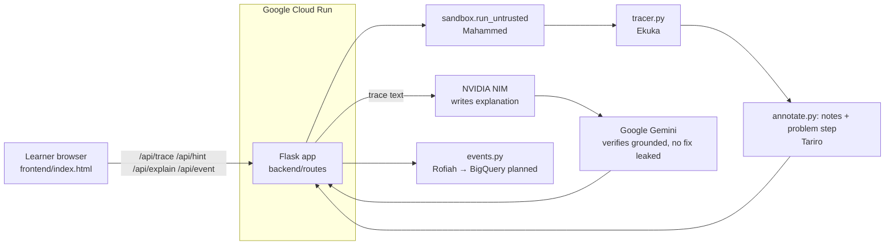

# Architecture

```mermaid
flowchart LR
  L[Learner browser<br/>frontend/index.html] -->|/api/trace /api/hint /api/explain /api/event| F[Flask app<br/>backend/routes]
  F --> S[sandbox.run_untrusted<br/>Mahammed]
  S --> T[tracer.py<br/>Ekuka]
  T --> A[annotate.py: notes + problem step<br/>Tariro]
  A --> F
  F -->|trace text| N[NVIDIA NIM<br/>writes explanation]
  N --> G[Google Gemini<br/>verifies grounded, no fix leaked]
  G --> F
  F --> E[events.py<br/>Rofiah → BigQuery planned]
  subgraph Google Cloud Run
    F
  end
```
Data shapes between parts are in `src/CONTRACT.md`.
